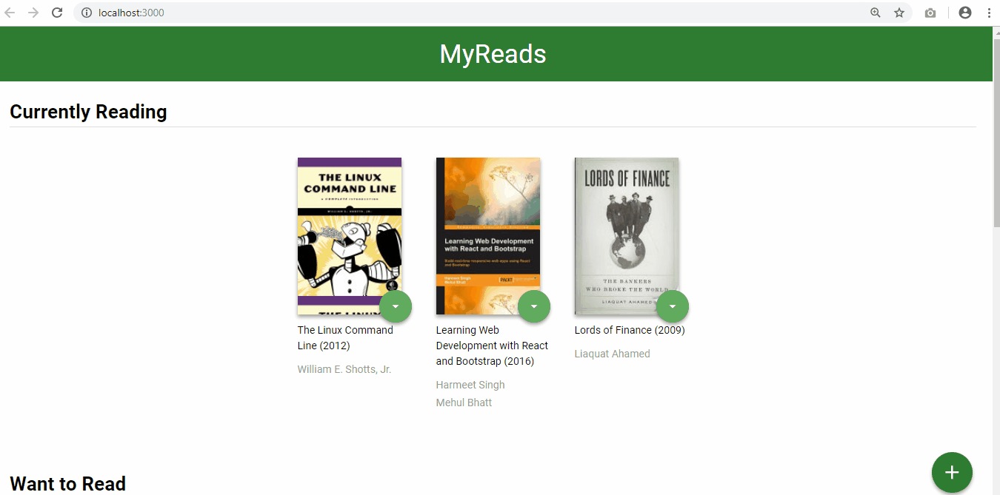

# My Reads
[](https://travis-ci.org/vimaciel/my-reads)

by [Vinicius Furusho Maciel](https://www.linkedin.com/in/vimaciel)

If you use My Read you can organize your books on shelves. These shelves are divided into three main categories: Currently Reading, Want to Read and Read. You are free to move your books into these shelves' categories listed previously. Also, you can do a research to find more books if you want. 

My Read is a required project to complete the course [React Nanodegree](https://br.udacity.com/course/react-nanodegree--nd019) by Udacity. My Read was developed based on [reactnd-project-myreads-starter](https://github.com/udacity/reactnd-project-myreads-starter) repository provided by Udacity.

### Directory Structure

To keep the My Read project organized was created folders inside the src, as you can see below:
```bash
└── src
    ├── components # Now all components' app lives here
    ├── styles # The css files used on the app lives here
    ├── test # test files must be here
    ├── ... # The same structure of reactnd-project-myreads-starter
```

### How to use
*You need node installed to use My Reads*

To install the dependencies execute this:
```sh
$ npm install
```
And to test the app execute this
```sh
$ npm test
```

... and finally, run the app executing this
```sh
$ npm start
```

The resulting will be......



### License
MIT