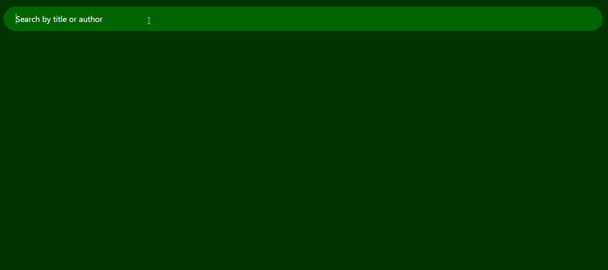

# My Reads
[](https://travis-ci.org/vimaciel/my-reads)

by [Vinicius Furusho Maciel](https://www.linkedin.com/in/vimaciel)

If you use My Read you can organize your books on shelves. These shelves are divided into three main categories: Currently Reading, Want to Read and Read. You are free to move your books into these shelves' categories listed previously. Also, you can do a research to find more books if you want. 

My Read is a required project to complete the course [React Nanodegree](https://br.udacity.com/course/react-nanodegree--nd019) by Udacity. My Read was developed based on [reactnd-project-myreads-starter](https://github.com/udacity/reactnd-project-myreads-starter) repository provided by Udacity.

### Directory Structure

To keep the My Read project organized was created folders inside the src, as you can see below:
```bash
└── src
    ├── components # Now all components' app lives here
    ├── styles # The css files used on the app lives here
    ├── images # Image files used on the app
    ├── test # test files must be here
    ├── ... # The same structure of reactnd-project-myreads-starter
```

### How to use
*You need node installed to use My Reads*

To install the dependencies execute this:
```sh
$ npm install
```
And to test the app execute this
```sh
$ npm test
```

... and finally, run the app executing this
```sh
$ npm start
```
### Extra Features

I'd like to describe some extra features implemented in this project:

### Debounce
To prevent request to the server unnecessary when a user is doing a research we can use a technique as know debounce. The debounce works when the user stops typing and them after that, with determined time a request happens, avoding requests each user's type. To implement this I've used a [debounce feature](https://lodash.com/docs/4.17.11#debounce) from [loadash](https://lodash.com/) framework.

### Reactstrap

To improve the style of the whole project I've used [reactstrap](https://github.com/reactstrap/reactstrap). If you notice, the reactstrap components use bootstrap 4 under the root. 

### Drag and Drop
To make the user's life easier, I've implemented drag and drop to move the books between shelves. Although there are awesome libraries for React with drag and drop feature on github, like [react-beautiful-dnd](https://github.com/atlassian/react-beautiful-dnd) for example, I've decided to implement the drag and drop only with native features for my self-study purpose.


### Loading indicator
Some situations the system need notify the user that something heavy is happening under the root. Said that the loading indicator is a good way to notify the user when that situation occurs. There are two situations witch the loading indicator shows:

- On Load all books from the server


- When user do research for books



The complete resulting will be......


### License
MIT
